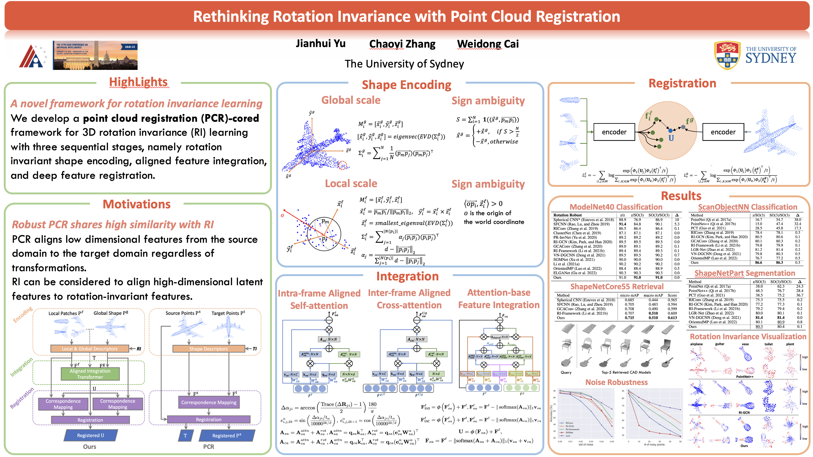

# Rethink Rotation

Official implementation of "Rethinking Rotation Invariance as Point Cloud Registration", AAAI 2023

[[Paper]]() [[Supp.]]() [[Video]]()



## Requirements

To build the CUDA kernel for FPS:
``` 
pip install pointnet2_ops_lib/.  
``` 
<b>NOTE:</b> If you encounter problems while building the kernel, 
you can refer to [Pointnet2_PyTorch](https://github.com/erikwijmans/Pointnet2_PyTorch) for solutions.


## Code

This repo contains Pytorch implementation of the following modules:
- [x] ModelNet40 Classification under rotations
    ``` 
    bash scripts/modelnet_cls.sh
    ```
- [x] ScanObjectNN Classification under rotations
    ``` 
    bash scripts/scanobject_cls.sh
    ```
- [ ] ShapeNetPart Segmentation under rotations


## Performance

* State-of-the-art accuracy on ModelNet40 under rotation: <b>91.0%</b> (z/z), <b>91.0%</b> (z/SO(3)).
* State-of-the-art accuracy on ScanObjectNN OBJ_BG classification under rotation: <b>86.6%</b> (z/z), <b>86.3%</b> (z/SO(3)).
* State-of-the-art micro and macro mAP on ShapeNetCore55 under rotation: <b>0.715</b>, <b>0.510</b>.
* ShapeNetPart segmentation under rotation: <b>80.3%</b> (z/z), <b>80.4%</b> (z/SO(3)).


## Citation  

If you find this repo useful in your work or research, please cite:  


## Acknowledgement

Our code borrows a lot from:
- [DGCNN](https://github.com/WangYueFt/dgcnn)
- [DGCNN.pytorch](https://github.com/AnTao97/dgcnn.pytorch)
- [PointContrast](https://github.com/facebookresearch/PointContrast)